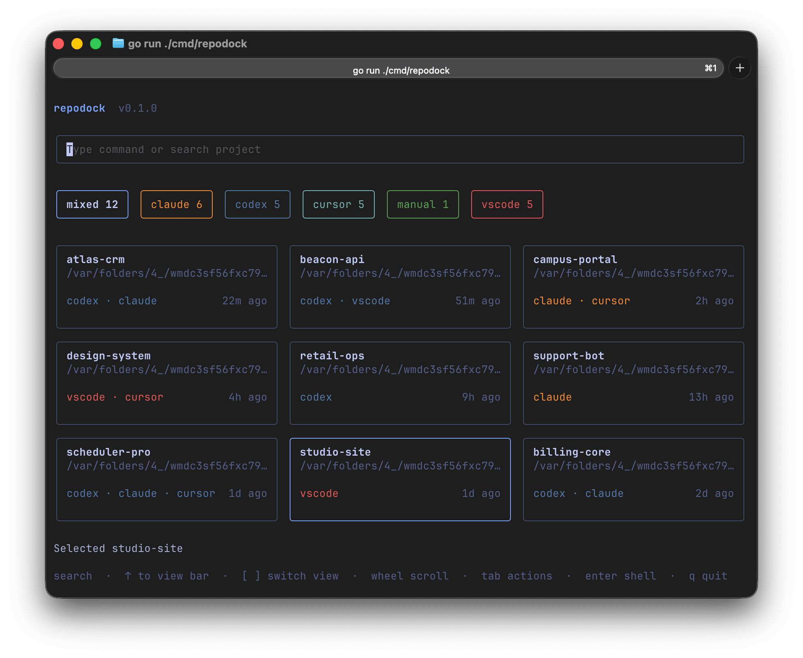
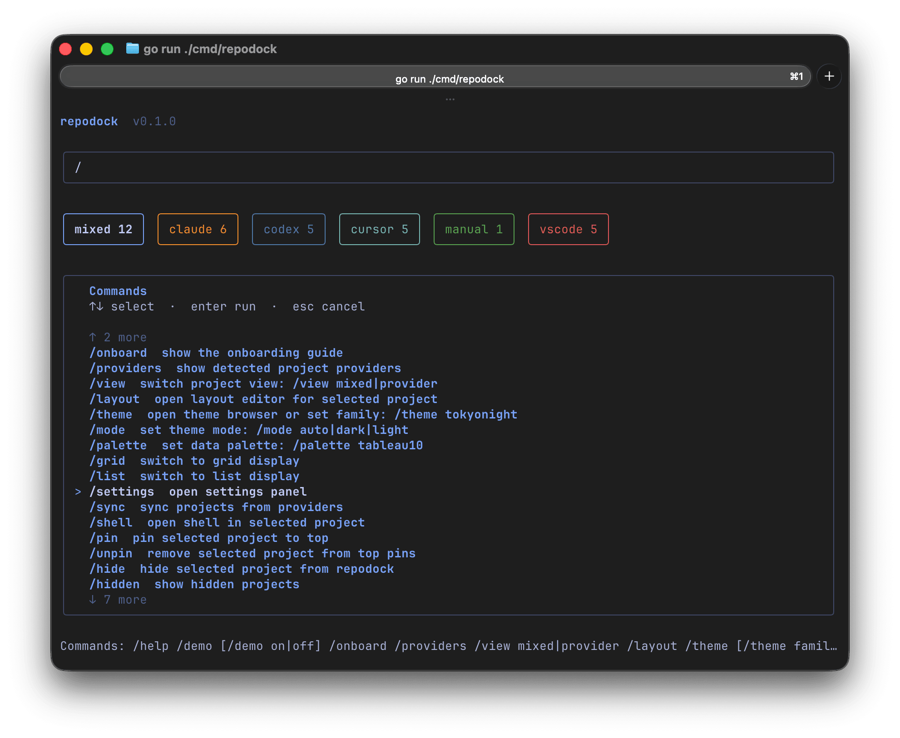
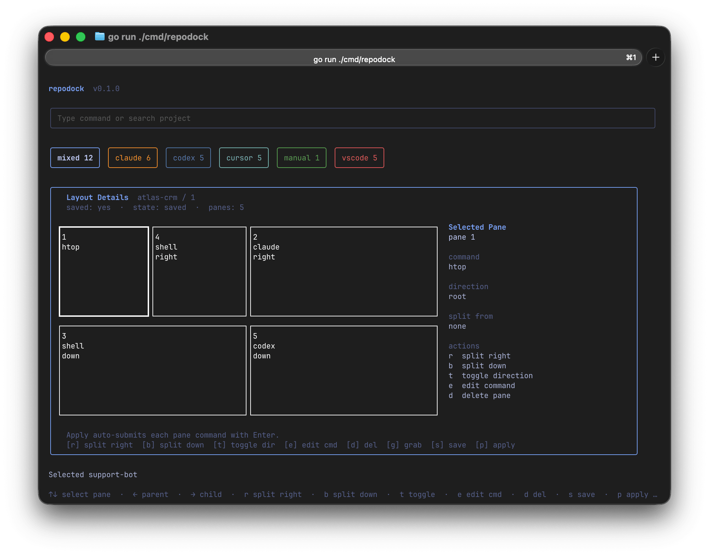
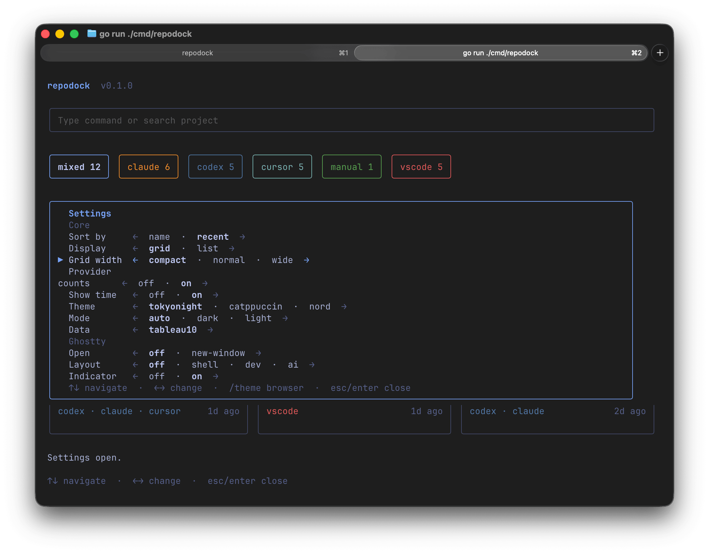

# RepoDock

RepoDock is a project-aware Go CLI/TUI launcher.

It aggregates projects from local tools like Codex, Claude, VS Code, Cursor, and other providers, then lets you jump into the right project context without manually `cd`-ing from `~`.

RepoDock is still under active development. Features, UI details, and provider behavior may change, and some flows may still be unstable.

## Current scope

- Project aggregation from multiple providers
- Mixed/grid/list project views
- Quick project actions from a single TUI
- Layout presets for project launch workflows
- Privacy-safe demo mode for showing the app publicly

## Demo

| Main View | Command Palette |
| --- | --- |
|  |  |
| Layout Editor | Settings |
|  |  |

## Local development

```bash
go run ./cmd/repodock
```

Version output:

```bash
go run ./cmd/repodock --version
```

Release artifacts:

```bash
make dist
```

## License

Copyright © 2026 RoversX / CloseX. Licensed under GPL-3.0.
